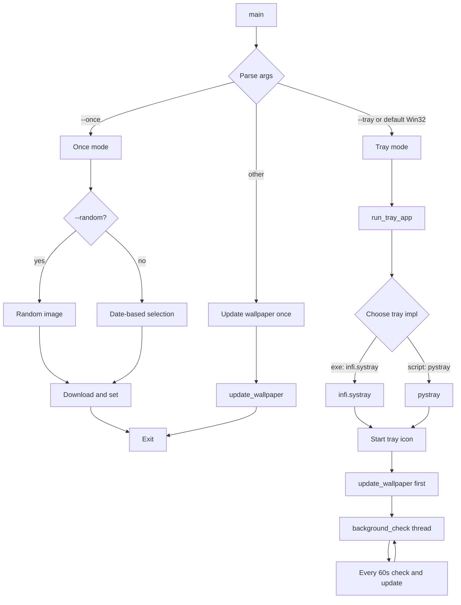
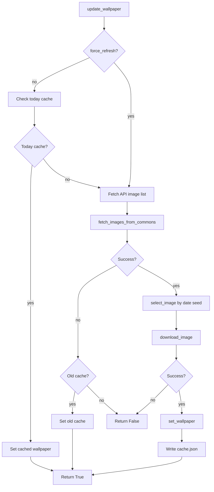
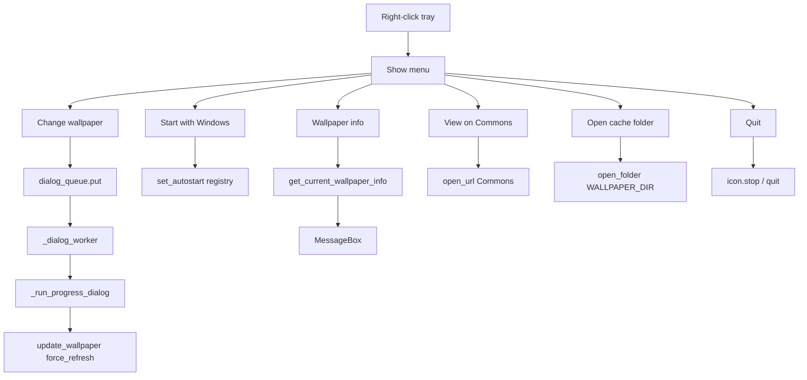

# Daily Commons Wallpaper - Architecture & Function Reference

**Other language:** [简体中文 (ARCHITECTURE_zh.md)](ARCHITECTURE_zh.md)

---

## 1. Program Flow

### 1.1 Main Flow



### 1.2 Wallpaper Update Flow (update_wallpaper)



### 1.3 Tray Menu Flow



---

## 2. Modules & Functions

### 2.1 wallpaper.py - Entry

| Function | Description |
|----------|-------------|
| `main()` | Parse CLI; dispatch to once / tray / single update by `--once`, `--tray`, or default |

### 2.2 config.py - Constants

| Constant / Function | Description |
|--------------------|-------------|
| `MIN_WIDTH`, `MIN_HEIGHT` | Min resolution 1920×1080 |
| `CATEGORY` | Commons category name |
| `API_URL` | Wikimedia API URL |
| `WALLPAPER_DIR` | Cache dir `%USERPROFILE%\.daily_commons_wallpaper` |
| `CACHE_FILE` | `cache.json` |
| `CONFIG_FILE` | `config.json` |
| `ICON_FILE` | `tray_icon.ico` |
| `CHECK_INTERVAL` | Background check interval (seconds) |
| `get_exe_path()` | Current executable path (PyInstaller-aware) |

### 2.3 core.py - Core Logic

| Function | Description |
|----------|-------------|
| `ensure_dir()` | Create `WALLPAPER_DIR` if missing |
| `load_config()` | Load config from `config.json` |
| `save_config(config)` | Save config to `config.json` |
| `_strip_html(text)` | Strip HTML tags |
| `_fetch_with_retry(req)` | HTTP request with retries (e.g. after boot) |
| `fetch_images_from_commons(limit)` | Fetch image list from Commons API, filter ≥1920×1080 |
| `fetch_image_metadata(file_title)` | Get image metadata by file title |
| `download_image(url, filepath, progress_callback, max_retries)` | Download image with retries and progress |
| `set_windows_wallpaper(filepath)` | Call `SystemParametersInfoW` |
| `set_wallpaper(filepath)` | Set wallpaper (Windows only) |
| `get_date_id()` | Return `YYYYMMDD` int |
| `select_image(images, seed)` | Pick one image by seed (deterministic hash) |
| `get_file_extension(url)` | Parse extension from URL |
| `_is_cache_from_today()` | Whether cache is from today; return `(bool, cache_dict)` |
| `update_wallpaper(force_refresh, progress_callback)` | Main flow: cache → fetch → select → download → set → write cache |
| `get_current_wallpaper_info()` | Read current wallpaper info from cache |
| `open_folder(path)` | Open folder in file manager |
| `open_url(url)` | Open URL in default browser |

### 2.4 tray.py - System Tray

| Function | Description |
|----------|-------------|
| `_load_i18n()` | Load i18n `t` |
| `is_autostart_enabled()` | Check Run key in registry |
| `set_autostart(enabled)` | Enable/disable startup (registry) |
| `create_tray_icon_file()` | Create tray ICO at `ICON_FILE` |
| `_get_ascii_safe_icon_path()` | Copy icon to temp, return ASCII-safe path (infi.systray) |
| `_show_message_box(title, message)` | Show Windows MessageBox |
| `_run_progress_dialog(on_complete)` | tkinter progress dialog; calls `update_wallpaper(force_refresh=True)` |
| `run_tray_app()` | Tray entry; choose infi.systray/pystray; start tray, first update, background thread |
| `_run_tray_pystray(...)` | pystray implementation (in-memory icon) |
| `_create_pil_icon()` | Draw 16×16 tray icon with PIL |

### 2.5 i18n/loader.py - i18n

| Function | Description |
|----------|-------------|
| `_get_i18n_dir()` | i18n dir (PyInstaller `_MEIPASS` aware) |
| `_detect_language()` | Detect language: Windows UI lang → LANG → locale |
| `load(lang)` | Load JSON strings for language |
| `t(key, default)` | Translated string for key |

### 2.6 i18n/*.json - Locales

| File | Language |
|------|----------|
| `en.json` | English |
| `zh_CN.json` | Simplified Chinese |
| `zh_TW.json` | Traditional Chinese |
| `ja.json` | Japanese |

---

## 3. Module Dependencies

```
wallpaper.py
  ├── config.py
  ├── core.py (ensure_dir, fetch_images_from_commons, ...)
  └── tray.py (run_tray_app)

tray.py
  ├── config.py
  └── core.py (ensure_dir, get_current_wallpaper_info, open_folder, open_url, update_wallpaper)

core.py
  └── config.py

i18n/loader.py
  └── (no project imports)
```

---

## 4. Thread Model

| Thread | Role |
|--------|------|
| Main | Tray message loop (infi.systray) or pystray.run |
| `_dialog_worker` | Consume queue; run progress dialog and update wallpaper |
| `background_check` | Every `CHECK_INTERVAL` s, call `update_wallpaper` |
