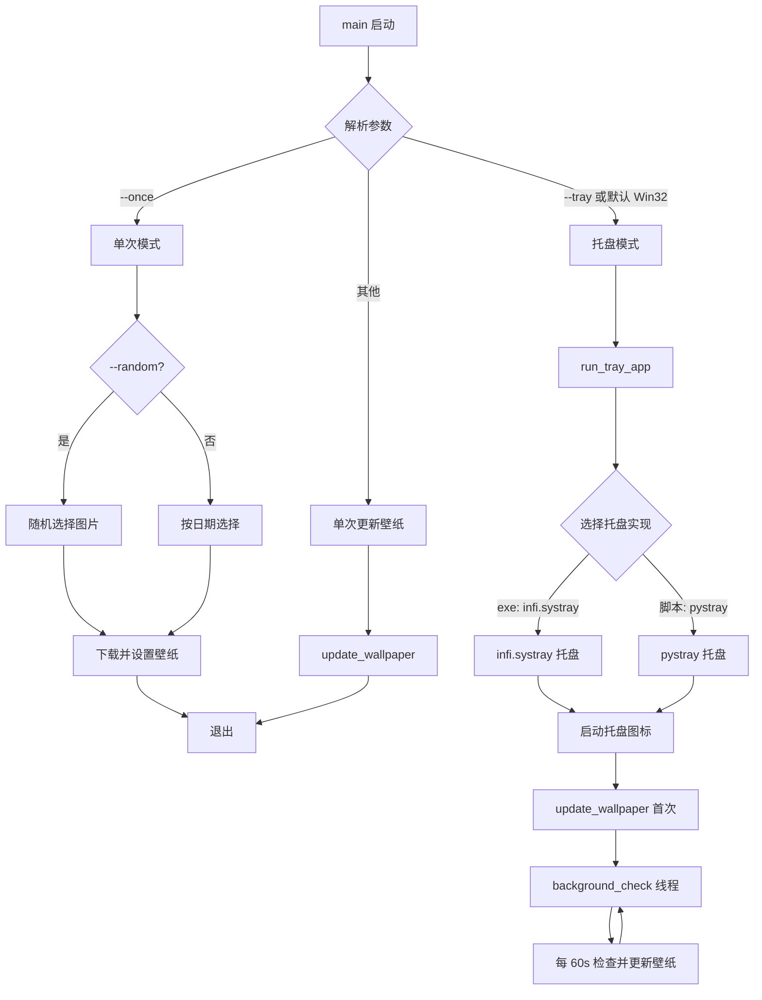
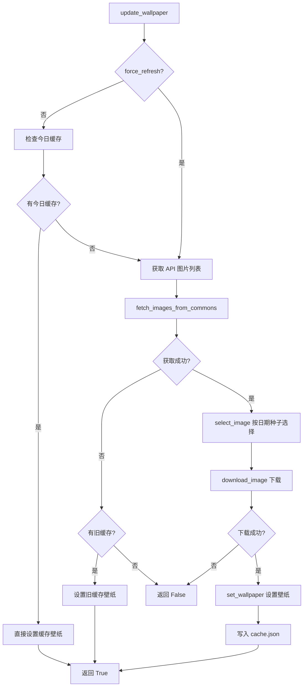
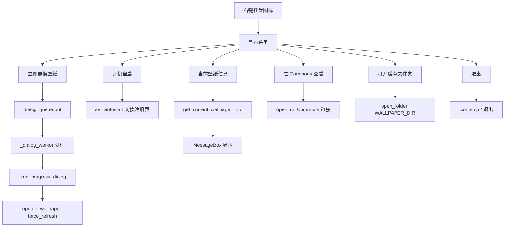

# Daily Commons Wallpaper - 程序架构与函数说明

**Other language:** [English (ARCHITECTURE.md)](ARCHITECTURE.md)

---

## 1. 程序流程图

### 1.1 主流程



### 1.2 壁纸更新流程 (update_wallpaper)



### 1.3 托盘菜单交互流程



---

## 2. 模块与函数说明

### 2.1 wallpaper.py - 主入口

| 函数 | 说明 |
|------|------|
| `main()` | 解析命令行参数，根据 `--once` / `--tray` / 默认选择单次模式、托盘模式或直接更新壁纸 |

### 2.2 config.py - 配置常量

| 常量/函数 | 说明 |
|----------|------|
| `MIN_WIDTH`, `MIN_HEIGHT` | 壁纸最小分辨率 1920×1080 |
| `CATEGORY` | Commons 分类名 |
| `API_URL` | Wikimedia API 地址 |
| `WALLPAPER_DIR` | 壁纸缓存目录 `%USERPROFILE%\.daily_commons_wallpaper` |
| `CACHE_FILE` | 缓存文件 `cache.json` |
| `CONFIG_FILE` | 配置文件 `config.json` |
| `ICON_FILE` | 托盘图标文件 `tray_icon.ico` |
| `CHECK_INTERVAL` | 后台检查间隔（秒） |
| `get_exe_path()` | 获取当前可执行文件路径，支持 PyInstaller 打包 |

### 2.3 core.py - 核心逻辑

| 函数 | 说明 |
|------|------|
| `ensure_dir()` | 确保 `WALLPAPER_DIR` 存在 |
| `load_config()` | 从 `config.json` 加载配置 |
| `save_config(config)` | 保存配置到 `config.json` |
| `_strip_html(text)` | 去除 HTML 标签 |
| `_fetch_with_retry(req)` | 带重试的 HTTP 请求（开机网络未就绪时重试） |
| `fetch_images_from_commons(limit)` | 从 Commons API 获取图片列表，过滤 ≥1920×1080 |
| `fetch_image_metadata(file_title)` | 根据文件名获取图片元数据 |
| `download_image(url, filepath, progress_callback, max_retries)` | 下载图片到本地，带重试和进度回调 |
| `set_windows_wallpaper(filepath)` | 调用 `SystemParametersInfoW` 设置 Windows 壁纸 |
| `set_wallpaper(filepath)` | 跨平台设置壁纸（当前仅 Windows） |
| `get_date_id()` | 返回 `YYYYMMDD` 整数 |
| `select_image(images, seed)` | 按种子从列表中选择一张图片（确定性哈希） |
| `get_file_extension(url)` | 从 URL 解析文件扩展名 |
| `_is_cache_from_today()` | 检查缓存是否为今日，返回 `(bool, cache_dict)` |
| `update_wallpaper(force_refresh, progress_callback)` | 主更新逻辑：检查缓存 → 拉取 → 选择 → 下载 → 设置 → 写缓存 |
| `get_current_wallpaper_info()` | 从缓存读取当前壁纸信息（标题、作者、链接等） |
| `open_folder(path)` | 用系统文件管理器打开文件夹 |
| `open_url(url)` | 用默认浏览器打开 URL |

### 2.4 tray.py - 系统托盘

| 函数 | 说明 |
|------|------|
| `_load_i18n()` | 加载 i18n 的 `t` 翻译函数 |
| `is_autostart_enabled()` | 检查注册表 Run 项是否已添加 |
| `set_autostart(enabled)` | 开启/关闭开机自启（写入注册表） |
| `create_tray_icon_file()` | 在 `ICON_FILE` 创建托盘图标 ICO 文件 |
| `_get_ascii_safe_icon_path()` | 复制图标到 temp 并返回 ASCII 安全路径（infi.systray 用） |
| `_show_message_box(title, message)` | 弹出 Windows MessageBox |
| `_run_progress_dialog(on_complete)` | tkinter 进度对话框，调用 `update_wallpaper(force_refresh=True)` |
| `run_tray_app()` | 托盘主入口：选择 infi.systray / pystray，启动托盘、首次更新、后台检查线程 |
| `_run_tray_pystray(...)` | 使用 pystray 实现托盘（内存图标） |
| `_create_pil_icon()` | 用 PIL 绘制 16×16 托盘图标 |

### 2.5 i18n/loader.py - 多语言

| 函数 | 说明 |
|------|------|
| `_get_i18n_dir()` | 获取 i18n 目录（支持 PyInstaller `_MEIPASS`） |
| `_detect_language()` | 检测系统语言：Windows `GetUserDefaultUILanguage` → LANG 环境变量 → locale |
| `load(lang)` | 加载指定语言的 JSON 字符串 |
| `t(key, default)` | 根据 key 返回翻译文案 |

### 2.6 i18n/*.json - 语言文件

| 文件 | 语言 |
|------|------|
| `en.json` | 英语 |
| `zh_CN.json` | 简体中文 |
| `zh_TW.json` | 繁体中文 |
| `ja.json` | 日语 |

---

## 3. 模块依赖关系

```
wallpaper.py
  ├── config.py
  ├── core.py (ensure_dir, fetch_images_from_commons, ...)
  └── tray.py (run_tray_app)

tray.py
  ├── config.py
  └── core.py (ensure_dir, get_current_wallpaper_info, open_folder, open_url, update_wallpaper)

core.py
  └── config.py

i18n/loader.py
  └── (无项目内依赖)
```

---

## 4. 线程模型

| 线程 | 用途 |
|------|------|
| 主线程 | 托盘消息循环（infi.systray）或 pystray.run（pystray） |
| `_dialog_worker` | 从队列取任务，执行进度对话框并更新壁纸 |
| `background_check` | 每 `CHECK_INTERVAL` 秒检查日期并调用 `update_wallpaper` |
